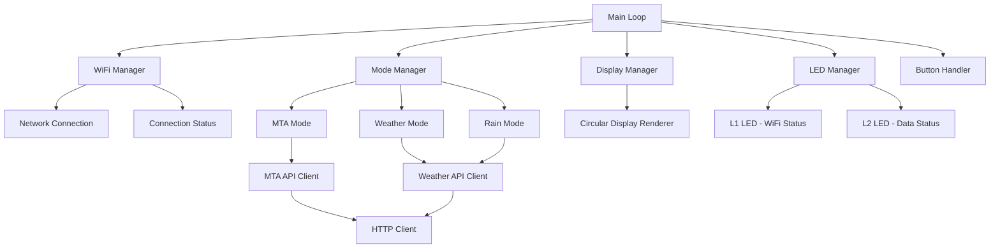

# Design Document

## Overview

The Arduino Opla MTA firmware is a multi-mode information display system that connects to WiFi networks to fetch and display real-time transit and weather data. The system leverages the Arduino Opla's built-in WiFi module (ESP32), circular TFT display, 5 physical buttons, and 2 RGB LEDs to create an intuitive commuter information device.

The firmware implements a state machine architecture with distinct modes for MTA transit data, weather information, and rain probability. Each mode manages its own data fetching, display rendering, and LED status indication while sharing common WiFi and system management services.

## Architecture

### System Architecture



### Component Hierarchy

- **System Core**
  - Main application loop and system initialization
  - Hardware abstraction layer for Arduino Opla
  
- **Network Layer**
  - WiFi connection management with multiple SSID support
  - HTTP client for API communications
  - Connection status monitoring and recovery
  
- **Application Layer**
  - Mode management and state transitions
  - Data fetching and caching services
  - User interface and interaction handling
  
- **Hardware Interface Layer**
  - Circular display rendering engine
  - LED status indication system
  - Button input processing

## Components and Interfaces

### WiFi Manager
**Purpose:** Manages network connectivity with automatic failover between configured networks.

**Key Methods:**
- `begin()` - Initialize WiFi with hardcoded credentials
- `connect()` - Attempt connection to available networks
- `isConnected()` - Check current connection status
- `getStatus()` - Return detailed connection state

**Configuration:**
```cpp
struct WiFiCredentials {
    const char* ssid;
    const char* password;
    int priority;
};
```

### Mode Manager
**Purpose:** Coordinates between different operational modes and handles mode transitions.

**Key Methods:**
- `setMode(ModeType mode)` - Switch to specified mode
- `getCurrentMode()` - Return active mode
- `update()` - Process current mode logic
- `handleButtonPress(int button)` - Route button events to appropriate mode

**Mode Types:**
- `MTA_MODE_1` - First MTA train/station combination
- `MTA_MODE_2` - Second MTA train/station combination  
- `MTA_MODE_3` - Third MTA train/station combination
- `WEATHER_MODE` - Temperature and humidity display
- `RAIN_MODE` - Rain probability display

### MTA API Client
**Purpose:** Interfaces with MTA real-time data feeds to retrieve train arrival information.

**API Endpoint:** `https://api-endpoint.mta.info/Dataservice/mtagtfsfeeds/nyct%2Fgtfs`
**Authentication:** Requires MTA API key

**Key Methods:**
- `fetchTrainData(trainLine, stationId)` - Get arrival times for specific train/station
- `parseGTFSData(rawData)` - Convert GTFS-RT protobuf to usable format
- `getCachedData(trainLine, stationId)` - Retrieve cached arrival data

**Data Structure:**
```cpp
struct TrainArrival {
    String trainLine;
    String stationName;
    int arrivalMinutes;
    String direction;
    unsigned long timestamp;
};
```

### Weather API Client
**Purpose:** Fetches current weather conditions and rain probability from weather service.

**API Endpoint:** OpenWeatherMap API or similar service
**Authentication:** Requires API key

**Key Methods:**
- `fetchCurrentWeather(lat, lon)` - Get current temperature and humidity
- `fetchRainProbability(lat, lon)` - Get precipitation forecast
- `getCachedWeatherData()` - Retrieve cached weather information

**Data Structure:**
```cpp
struct WeatherData {
    float temperature;
    int humidity;
    int rainProbability;
    String conditions;
    unsigned long timestamp;
};
```

### Display Manager
**Purpose:** Renders information on the circular TFT display with optimized layouts.

**Key Methods:**
- `renderMTAData(TrainArrival* arrivals, int count)` - Display train arrival times
- `renderWeatherData(WeatherData data)` - Show temperature and humidity
- `renderRainData(WeatherData data)` - Display rain probability
- `showLoadingScreen(String message)` - Show loading/connecting status
- `showErrorScreen(String error)` - Display error messages

**Display Layouts:**
- **Circular Train Display:** Arrival times arranged radially around station name
- **Weather Display:** Large temperature with humidity below
- **Rain Display:** Probability percentage with time window

### LED Manager
**Purpose:** Controls the two RGB LEDs for system and data status indication.

**Key Methods:**
- `setWiFiStatus(ConnectionStatus status)` - Control L1 LED based on WiFi state
- `setDataStatus(DataStatus status)` - Control L2 LED based on data retrieval state
- `update()` - Handle LED animations and transitions

**Status Colors:**
- **L1 (WiFi):** Red (disconnected), Yellow (connecting), Green (connected)
- **L2 (Data):** Red (error), Yellow (loading), Green (success)

## Data Models

### Configuration Model
```cpp
struct SystemConfig {
    WiFiCredentials networks[5];
    struct {
        String trainLine;
        String stationId;
        String stationName;
    } mtaConfigs[3];
    
    struct {
        float latitude;
        float longitude;
        String apiKey;
    } weatherConfig;
    
    String mtaApiKey;
    int refreshIntervals[3]; // MTA, Weather, Rain in seconds
};
```

### Cache Model
```cpp
struct DataCache {
    TrainArrival mtaData[3][6]; // 3 configs, up to 6 arrivals each
    WeatherData weatherData;
    unsigned long lastUpdate[4]; // MTA1, MTA2, MTA3, Weather
    bool isValid[4];
};
```

## Error Handling

### Network Error Handling
- **Connection Failures:** Automatic retry with exponential backoff
- **API Timeouts:** Fall back to cached data with timestamp display
- **Rate Limiting:** Implement request throttling and queue management

### Data Error Handling
- **Invalid API Responses:** Display error message and retry after delay
- **Parsing Errors:** Log error and attempt to use partial data if available
- **Cache Corruption:** Clear cache and force fresh data fetch

### Hardware Error Handling
- **Display Failures:** Attempt display reset, fall back to LED-only status
- **Button Debouncing:** Implement software debouncing with configurable timing
- **Memory Issues:** Implement garbage collection and memory monitoring

## Testing Strategy

### Unit Testing
- **WiFi Manager:** Mock network connections and test failover logic
- **API Clients:** Mock HTTP responses and test data parsing
- **Display Manager:** Test layout calculations and rendering logic
- **LED Manager:** Verify color transitions and status mappings

### Integration Testing
- **End-to-End Mode Testing:** Verify complete user workflows for each mode
- **Network Recovery Testing:** Test behavior during network interruptions
- **API Failure Testing:** Validate graceful degradation when APIs are unavailable
- **Hardware Integration:** Test with actual Arduino Opla hardware

### Performance Testing
- **Memory Usage:** Monitor heap usage during normal operation
- **Response Times:** Measure API call latency and display update speed
- **Battery Life:** Test power consumption in different modes (if battery powered)
- **Network Efficiency:** Optimize API call frequency and data usage

### User Acceptance Testing
- **Display Readability:** Verify information is clearly visible on circular display
- **Button Responsiveness:** Test button press handling and mode switching
- **LED Clarity:** Ensure status LEDs provide clear visual feedback
- **Real-world Usage:** Test with actual MTA data during different times of day